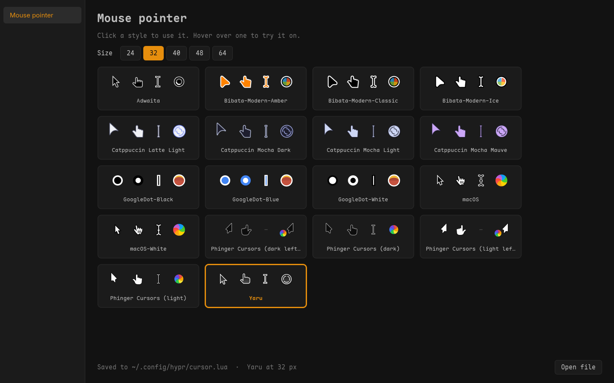

# omasettings

Click-through settings for Omarchy, in the same native Qt6 style as omatimer.
Each page writes a plain config file under `~/.config`, so the file stays the
source of truth: change it in the app or by hand, and the other side follows
live.



## What it is

A native Qt app in the same style as omatimer. Its first page is the mouse
pointer.

**What it does:**
- Each installed pointer style shows as a card with four of its shapes
  (arrow, hand, text, loading), drawn at your chosen size.
- Click a card to switch to it. Hover over a card to try its arrow before you
  pick it.
- The size buttons are 24, 32, 40, 48 and 64.
- Colors follow your Omarchy theme and update when you change themes.
- You can also set it from the terminal:
  `omasettings pointer Bibata-Modern-Ice 40`.
- You can open it from the app launcher like any other app.

**The file is still in charge:** the pointer setting lives in its own file,
`~/.config/hypr/cursor.lua`, which `hyprland.lua` loads. The app saves to that
file, and if you edit the file by hand, the app picks up the change right
away.

**Styles:** 16 extra styles (Bibata, Catppuccin, GoogleDot, macOS and Phinger)
are installed into `~/.local/share/icons`, so no password was needed. Any style
added to that folder later shows up the next time the app opens. See
[Installing more pointer styles](#installing-more-pointer-styles).

**Next pages** that would fit: keyboard, display, sound and fonts. See
[Adding a page](#adding-a-page).

## Build

Needs `qt6-base`.

```sh
qmake6 omasettings.pro -o Makefile
make -j$(nproc)
./omasettings
```

`~/.local/bin/omasettings` links to the built binary, and
`~/.local/share/applications/omasettings.desktop` puts it in the launcher.

## Use

```sh
omasettings                          # open the window
omasettings pointer                  # print the current pointer and size
omasettings pointer Yaru 32          # set it without opening the window
```

Esc or Ctrl+Q closes the window.

## Pages

### Mouse pointer

Every installed cursor theme shows as a card with its arrow, hand, text and
wait shapes, drawn at the size you've picked. Click a card to switch; hover
one to try its arrow on first. Sizes are 24 (Omarchy's default) to 64.

- **File:** `~/.config/hypr/cursor.lua`, loaded by `require("hypr.cursor")`
  at the end of `~/.config/hypr/hyprland.lua`. The app rewrites it whole.
- **Live switch:** `hyprctl setcursor` for the pointer on screen, and
  `gsettings` for GTK apps, which read their own setting. Apps that were
  already open may keep the old pointer until they're reopened.
- **Themes:** found in `~/.local/share/icons`, `~/.icons` and
  `/usr/share/icons` (any folder with a `cursors/` inside). Drop a new theme
  in `~/.local/share/icons` and it appears next launch. Shapes a theme leaves
  out are borrowed from its `Inherits=` parent, as libXcursor does.

Cursor files are Xcursor format, which Qt can't read, so a small reader in
`main.cpp` pulls out the first frame at the nearest size.

## Colors

From the current Omarchy theme (`~/.local/state/omarchy/current/theme/colors.toml`),
re-tinted live on theme change, the same as omatimer and omacalc.

## Adding a page

Write a `QWidget` for it and call `addPage("Name", widget)` in the
`Omasettings` constructor. Keep its settings in their own file under
`~/.config` so hand edits and the app never fight over a shared file.

## Installing more pointer styles

No `sudo` needed: unpack a theme into `~/.local/share/icons`. The 16 installed
so far came from these GitHub releases:

| Style | Source |
|---|---|
| Bibata Modern Amber / Classic / Ice | [ful1e5/Bibata_Cursor](https://github.com/ful1e5/Bibata_Cursor/releases) |
| Catppuccin Mocha Dark / Light / Mauve, Latte Light | [catppuccin/cursors](https://github.com/catppuccin/cursors/releases) |
| GoogleDot Black / White / Blue | [ful1e5/Google_Cursor](https://github.com/ful1e5/Google_Cursor/releases) |
| macOS, macOS White | [ful1e5/apple_cursor](https://github.com/ful1e5/apple_cursor/releases) |
| Phinger dark / light (plus left-handed) | [phisch/phinger-cursors](https://github.com/phisch/phinger-cursors/releases) |

```sh
curl -sLO https://github.com/ful1e5/Bibata_Cursor/releases/download/v2.0.7/Bibata-Modern-Ice.tar.xz
tar -xf Bibata-Modern-Ice.tar.xz -C ~/.local/share/icons
```
